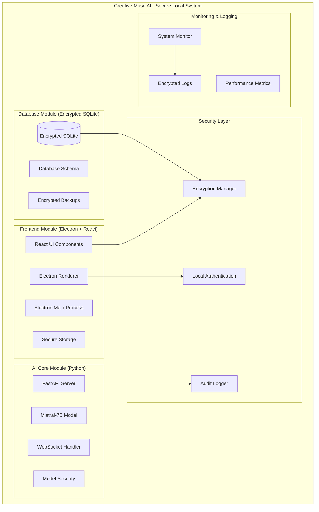
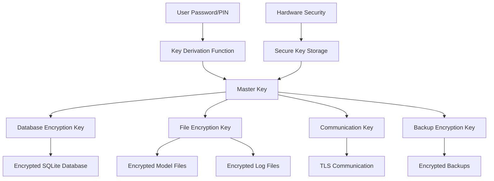
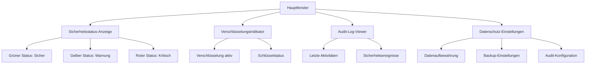

# Creative Muse AI - Vollständiges Konzeptdokument

## 🎯 Projektübersicht

**Creative Muse AI** ist eine vollständig offline-fähige, modulare AI-Anwendung für kreative Ideengenerierung mit höchsten Sicherheits- und Datenschutzstandards. Das System nutzt lokale LLM-Modelle (Mistral-7B-Instruct-v0.3) und gewährleistet vollständige Datensouveränität.

### Kernprinzipien
- **100% Offline-Funktionalität**: Keine Internetverbindung erforderlich
- **Modulare Architektur (Modus)**: Klare Trennung der Verantwortlichkeiten
- **Privacy by Design**: Verschlüsselte lokale Datenspeicherung
- **Security First**: Umfassende Sicherheitsmaßnahmen und Audit-Logs
- **Zero Trust**: Keine externen Abhängigkeiten zur Laufzeit

## 🏗️ Systemarchitektur



## 📁 Erweiterte Projektstruktur

```
creative_muse_ai/
├── 📁 ai_core/                    # Python Backend Module
│   ├── 📁 models/                 # LLM Model Storage (Encrypted)
│   │   ├── mistral-7b-instruct/   # Model files
│   │   └── model_checksums.json   # Integrity verification
│   ├── 📁 api/                    # API Layer
│   │   ├── __init__.py
│   │   ├── routes.py              # REST endpoints
│   │   ├── websocket.py           # WebSocket handlers
│   │   └── security.py            # API security middleware
│   ├── 📁 core/                   # Core AI Logic
│   │   ├── __init__.py
│   │   ├── model_manager.py       # Secure model loading
│   │   ├── idea_generator.py      # Main generation logic
│   │   └── input_sanitizer.py     # Input validation & sanitization
│   ├── 📁 database/               # Database Interface
│   │   ├── __init__.py
│   │   ├── models.py              # SQLAlchemy models
│   │   ├── crud.py                # Secure database operations
│   │   └── encryption.py          # Database encryption layer
│   ├── 📁 security/               # Security Module
│   │   ├── __init__.py
│   │   ├── crypto_manager.py      # Encryption/Decryption
│   │   ├── audit_logger.py        # Security audit logging
│   │   ├── session_manager.py     # Secure session handling
│   │   └── key_manager.py         # Cryptographic key management
│   ├── 📁 monitoring/             # System Monitoring
│   │   ├── __init__.py
│   │   ├── performance_monitor.py # Resource monitoring
│   │   ├── security_monitor.py    # Security event monitoring
│   │   └── health_checker.py      # System health checks
│   ├── main.py                    # FastAPI application
│   ├── requirements.txt           # Python dependencies
│   ├── requirements-security.txt  # Security-specific dependencies
│   └── config.py                  # Secure configuration management
│
├── 📁 ui_frontend/                # Electron Frontend Module
│   ├── 📁 src/                    # React Source Code
│   │   ├── 📁 components/         # React Components
│   │   │   ├── IdeaGenerator.jsx  # Main idea generation component
│   │   │   ├── IdeaList.jsx       # Ideas history component
│   │   │   ├── IdeaCard.jsx       # Individual idea display
│   │   │   ├── RatingSystem.jsx   # Star rating component
│   │   │   ├── SecurityStatus.jsx # Security status indicator
│   │   │   └── PrivacySettings.jsx # Privacy configuration
│   │   ├── 📁 hooks/              # Custom React Hooks
│   │   │   ├── useWebSocket.js    # Secure WebSocket connection
│   │   │   ├── useAPI.js          # Secure API communication
│   │   │   └── useEncryption.js   # Client-side encryption
│   │   ├── 📁 services/           # API Services
│   │   │   ├── apiClient.js       # Secure HTTP client
│   │   │   ├── encryptionService.js # Client-side encryption
│   │   │   └── auditService.js    # Audit logging service
│   │   ├── 📁 security/           # Frontend Security
│   │   │   ├── csp.js             # Content Security Policy
│   │   │   ├── sanitizer.js       # Input sanitization
│   │   │   └── secureStorage.js   # Secure local storage
│   │   ├── 📁 styles/             # CSS Styles
│   │   │   ├── main.css           # Main stylesheet
│   │   │   └── security.css       # Security UI styles
│   │   ├── App.jsx                # Main React application
│   │   └── index.jsx              # React entry point
│   ├── 📁 public/                 # Static Assets
│   │   └── index.html             # HTML template (CSP headers)
│   ├── 📁 security/               # Electron Security
│   │   ├── preload.js             # Secure preload script
│   │   ├── contextIsolation.js    # Context isolation
│   │   └── permissions.js         # Permission management
│   ├── electron.js                # Secure Electron main process
│   ├── package.json               # Node.js dependencies
│   ├── webpack.config.js          # Secure Webpack configuration
│   └── security-config.json       # Security configuration
│
├── 📁 database/                   # Database Module
│   ├── schema.sql                 # Database schema definition
│   ├── init_db.py                 # Secure database initialization
│   ├── migration_scripts/         # Database migration scripts
│   ├── backup_manager.py          # Encrypted backup management
│   └── creative_muse.db           # Encrypted SQLite database
│
├── 📁 security/                   # Global Security Module
│   ├── 📁 certificates/           # SSL/TLS certificates (self-signed)
│   ├── 📁 keys/                   # Cryptographic keys (encrypted)
│   ├── 📁 policies/               # Security policies
│   ├── audit_config.json          # Audit configuration
│   ├── security_policy.json       # Security policy definitions
│   └── compliance_checklist.md    # Security compliance checklist
│
├── 📁 logs/                       # Secure Logging
│   ├── 📁 audit/                  # Encrypted audit logs
│   ├── 📁 security/               # Security event logs
│   ├── 📁 performance/            # Performance logs
│   └── log_rotation_config.json   # Log rotation configuration
│
├── 📁 scripts/                    # Setup & Utility Scripts
│   ├── setup.sh                   # Complete secure setup script
│   ├── setup.bat                  # Windows secure setup script
│   ├── security_setup.sh          # Security-specific setup
│   ├── key_generation.py          # Cryptographic key generation
│   ├── backup_script.sh           # Encrypted backup script
│   ├── security_audit.py          # Security audit script
│   ├── start_backend.sh           # Secure backend startup
│   ├── start_frontend.sh          # Secure frontend startup
│   └── download_model.py          # Secure model download
│
├── 📁 docs/                       # Documentation
│   ├── API.md                     # API documentation
│   ├── SECURITY.md                # Security documentation
│   ├── PRIVACY.md                 # Privacy policy and practices
│   ├── DEVELOPMENT.md             # Secure development guide
│   ├── DEPLOYMENT.md              # Secure deployment instructions
│   ├── AUDIT.md                   # Audit procedures
│   └── COMPLIANCE.md              # Compliance guidelines
│
├── 📁 tests/                      # Test Suite
│   ├── 📁 security/               # Security tests
│   ├── 📁 integration/            # Integration tests
│   ├── 📁 performance/            # Performance tests
│   └── 📁 compliance/             # Compliance tests
│
├── README.md                      # Main project documentation
├── SECURITY.md                    # Security overview
├── PRIVACY.md                     # Privacy statement
├── Makefile                       # Secure build automation
├── .gitignore                     # Git ignore rules (security-aware)
├── .env.example                   # Environment variables template
├── security-config.yaml           # Global security configuration
└── requirements-dev.txt           # Development dependencies
```

## 🔒 Sicherheits- und Datenschutzarchitektur

### 🛡️ Sicherheitsebenen

#### 1. Anwendungsebene
- **Content Security Policy (CSP)**: Schutz vor XSS-Angriffen
- **Input Sanitization**: Vollständige Bereinigung aller Benutzereingaben
- **Context Isolation**: Electron-Sicherheit mit isolierten Kontexten
- **Secure Preload Scripts**: Minimale API-Exposition

#### 2. Datenebene
- **AES-256 Verschlüsselung**: Alle gespeicherten Daten
- **Schlüsselrotation**: Automatische Schlüsselaktualisierung
- **Secure Key Derivation**: PBKDF2 mit hohen Iterationen
- **Database Encryption**: SQLCipher für SQLite-Verschlüsselung

#### 3. Kommunikationsebene
- **TLS 1.3**: Lokale API-Kommunikation
- **WebSocket Security**: Verschlüsselte WebSocket-Verbindungen
- **Certificate Pinning**: Selbstsignierte Zertifikate
- **Message Authentication**: HMAC für Nachrichtenintegrität

#### 4. Systemebene
- **Process Isolation**: Getrennte Prozesse für verschiedene Module
- **Resource Limits**: Speicher- und CPU-Beschränkungen
- **File System Permissions**: Minimale Dateisystemberechtigungen
- **Secure Temporary Files**: Verschlüsselte temporäre Dateien

### 🔐 Verschlüsselungsarchitektur



### 📊 Erweiterte Datenbank-Schema (Sicherheit)

```sql
-- Ideas Table (Encrypted)
CREATE TABLE ideas (
    id INTEGER PRIMARY KEY AUTOINCREMENT,
    prompt_encrypted BLOB NOT NULL,           -- Encrypted prompt
    generated_idea_encrypted BLOB NOT NULL,   -- Encrypted generated idea
    rating INTEGER CHECK(rating >= 1 AND rating <= 5),
    category_encrypted BLOB,                  -- Encrypted category
    created_at TIMESTAMP DEFAULT CURRENT_TIMESTAMP,
    updated_at TIMESTAMP DEFAULT CURRENT_TIMESTAMP,
    is_favorite BOOLEAN DEFAULT FALSE,
    tags_encrypted BLOB,                      -- Encrypted JSON tags
    checksum TEXT NOT NULL,                   -- Data integrity checksum
    encryption_version INTEGER DEFAULT 1      -- Encryption version for migration
);

-- Audit Log Table
CREATE TABLE audit_logs (
    id INTEGER PRIMARY KEY AUTOINCREMENT,
    event_type VARCHAR(50) NOT NULL,
    event_description_encrypted BLOB,
    user_action VARCHAR(100),
    ip_address VARCHAR(45),
    timestamp TIMESTAMP DEFAULT CURRENT_TIMESTAMP,
    session_id VARCHAR(128),
    severity_level INTEGER DEFAULT 1,
    checksum TEXT NOT NULL
);

-- Security Events Table
CREATE TABLE security_events (
    id INTEGER PRIMARY KEY AUTOINCREMENT,
    event_category VARCHAR(50) NOT NULL,
    threat_level INTEGER CHECK(threat_level >= 1 AND threat_level <= 5),
    event_details_encrypted BLOB,
    source_component VARCHAR(100),
    timestamp TIMESTAMP DEFAULT CURRENT_TIMESTAMP,
    resolved BOOLEAN DEFAULT FALSE,
    resolution_notes_encrypted BLOB
);

-- Sessions Table (Enhanced Security)
CREATE TABLE sessions (
    id INTEGER PRIMARY KEY AUTOINCREMENT,
    session_id VARCHAR(128) UNIQUE NOT NULL,
    session_start TIMESTAMP DEFAULT CURRENT_TIMESTAMP,
    session_end TIMESTAMP,
    ideas_generated INTEGER DEFAULT 0,
    last_activity TIMESTAMP DEFAULT CURRENT_TIMESTAMP,
    ip_address VARCHAR(45),
    user_agent_hash VARCHAR(64),
    is_active BOOLEAN DEFAULT TRUE,
    security_flags INTEGER DEFAULT 0
);

-- Encryption Keys Metadata (Keys stored separately)
CREATE TABLE encryption_metadata (
    key_id VARCHAR(128) PRIMARY KEY,
    key_type VARCHAR(50) NOT NULL,
    created_at TIMESTAMP DEFAULT CURRENT_TIMESTAMP,
    last_rotation TIMESTAMP DEFAULT CURRENT_TIMESTAMP,
    rotation_interval_days INTEGER DEFAULT 90,
    is_active BOOLEAN DEFAULT TRUE,
    algorithm VARCHAR(50) DEFAULT 'AES-256-GCM'
);

-- Settings Table (Enhanced Security)
CREATE TABLE settings (
    key VARCHAR(50) PRIMARY KEY,
    value_encrypted BLOB NOT NULL,
    is_sensitive BOOLEAN DEFAULT FALSE,
    updated_at TIMESTAMP DEFAULT CURRENT_TIMESTAMP,
    updated_by VARCHAR(100),
    checksum TEXT NOT NULL
);

-- Performance Metrics (for monitoring)
CREATE TABLE performance_metrics (
    id INTEGER PRIMARY KEY AUTOINCREMENT,
    metric_name VARCHAR(100) NOT NULL,
    metric_value REAL NOT NULL,
    timestamp TIMESTAMP DEFAULT CURRENT_TIMESTAMP,
    component VARCHAR(50),
    additional_data_encrypted BLOB
);

-- Backup History
CREATE TABLE backup_history (
    id INTEGER PRIMARY KEY AUTOINCREMENT,
    backup_path_encrypted BLOB NOT NULL,
    backup_size INTEGER,
    backup_checksum TEXT NOT NULL,
    created_at TIMESTAMP DEFAULT CURRENT_TIMESTAMP,
    backup_type VARCHAR(20) DEFAULT 'automatic',
    encryption_key_id VARCHAR(128),
    is_verified BOOLEAN DEFAULT FALSE
);
```

### 🔍 Audit und Compliance

#### Audit-Kategorien
1. **Datenzugriff**: Alle Lese-/Schreiboperationen
2. **Systemereignisse**: Start/Stop, Konfigurationsänderungen
3. **Sicherheitsereignisse**: Authentifizierung, Autorisierung
4. **Performance-Ereignisse**: Ressourcennutzung, Latenz
5. **Fehler-Ereignisse**: Exceptions, Systemfehler

#### Compliance-Features
- **Datenminimierung**: Nur notwendige Daten speichern
- **Recht auf Löschung**: Vollständige Datenlöschung
- **Datenportabilität**: Export in standardisierten Formaten
- **Transparenz**: Vollständige Audit-Trails
- **Zweckbindung**: Klare Datenverwendungszwecke

### 🚀 Sicherheits-Setup-Automatisierung

#### Erweiterte Makefile-Targets
```makefile
# Vollständiges sicheres Setup
setup-secure: generate-keys setup-encryption install-deps init-secure-db

# Sicherheitsaudit durchführen
security-audit: check-dependencies scan-vulnerabilities verify-encryption

# Backup erstellen
backup: create-encrypted-backup verify-backup-integrity

# Schlüsselrotation
rotate-keys: backup-current-keys generate-new-keys migrate-data

# Compliance-Check
compliance-check: audit-data-handling verify-encryption check-permissions

# Sicherheitsmonitoring starten
start-monitoring: start-audit-logger start-security-monitor start-performance-monitor

# Sichere Entwicklungsumgebung
dev-secure: setup-secure start-monitoring start-backend start-frontend

# Sicherheitstests
test-security: test-encryption test-authentication test-authorization test-audit

# Notfall-Prozeduren
emergency-lockdown: stop-all-services encrypt-sensitive-data create-incident-report
```

### 📈 Performance und Sicherheit

#### Optimierungen
- **Lazy Loading**: Modelle nur bei Bedarf laden
- **Memory Protection**: Sichere Speicherverwaltung
- **Cache Security**: Verschlüsselte Zwischenspeicherung
- **Resource Monitoring**: Kontinuierliche Überwachung

#### Sicherheitsmetriken
- **Verschlüsselungslatenz**: < 10ms für Standardoperationen
- **Audit-Log-Performance**: < 1ms für Log-Einträge
- **Backup-Zeit**: Vollständiges Backup < 5 Minuten
- **Schlüsselrotation**: Automatisch alle 90 Tage

### 🔧 Technische Sicherheitsspezifikationen

#### Kryptographische Standards
- **Symmetric Encryption**: AES-256-GCM
- **Key Derivation**: PBKDF2 (100,000+ Iterationen)
- **Hashing**: SHA-256 für Checksums, Argon2 für Passwörter
- **Random Number Generation**: Kryptographisch sichere RNG
- **Digital Signatures**: Ed25519 für Datenintegrität

#### Netzwerksicherheit
- **Local TLS**: Selbstsignierte Zertifikate für lokale Kommunikation
- **Certificate Pinning**: Schutz vor Man-in-the-Middle
- **Network Isolation**: Keine ausgehenden Verbindungen
- **Port Security**: Minimale Port-Exposition

#### Dateisystemsicherheit
- **File Permissions**: Restriktive Berechtigungen (600/700)
- **Secure Deletion**: Überschreiben gelöschter Dateien
- **Temporary File Security**: Verschlüsselte temporäre Dateien
- **Path Traversal Protection**: Sichere Pfadvalidierung

### 🎨 Sicherheits-UI/UX Design



### 📋 Sicherheits-Implementierungsreihenfolge

1. **Phase 1: Sicherheitsgrundlagen** (Tag 1)
   - Kryptographische Schlüsselgenerierung
   - Basis-Verschlüsselungsinfrastruktur
   - Sichere Konfigurationsverwaltung

2. **Phase 2: Datenbank-Sicherheit** (Tag 1-2)
   - SQLCipher-Integration
   - Verschlüsselte Schema-Implementierung
   - Audit-Log-System

3. **Phase 3: API-Sicherheit** (Tag 2-3)
   - TLS-Setup für lokale Kommunikation
   - Input-Validierung und Sanitization
   - Sichere Session-Verwaltung

4. **Phase 4: Frontend-Sicherheit** (Tag 3-4)
   - Content Security Policy
   - Secure Storage Implementation
   - Context Isolation Setup

5. **Phase 5: Monitoring und Compliance** (Tag 4-5)
   - Audit-System-Integration
   - Performance-Monitoring
   - Compliance-Tests

6. **Phase 6: Backup und Recovery** (Tag 5)
   - Verschlüsselte Backup-Systeme
   - Disaster Recovery Procedures
   - Schlüsselrotations-Mechanismen

### 🛡️ Bedrohungsmodell und Gegenmaßnahmen

#### Identifizierte Bedrohungen
1. **Datendiebstahl**: Verschlüsselung aller gespeicherten Daten
2. **Malware-Infektion**: Process Isolation und Sandboxing
3. **Insider-Bedrohungen**: Umfassende Audit-Logs
4. **Physischer Zugriff**: Festplattenverschlüsselung erforderlich
5. **Software-Vulnerabilities**: Regelmäßige Dependency-Scans

#### Sicherheitskontrollen
- **Präventiv**: Verschlüsselung, Input-Validierung, CSP
- **Detektiv**: Audit-Logs, Anomalie-Erkennung, Monitoring
- **Korrektiv**: Automatische Backups, Incident Response
- **Kompensierend**: Offline-Betrieb, lokale Verarbeitung

### 📚 Dokumentation und Training

#### Sicherheitsdokumentation
- **Security Policy**: Umfassende Sicherheitsrichtlinien
- **Incident Response Plan**: Verfahren für Sicherheitsvorfälle
- **Data Handling Procedures**: Sichere Datenverarbeitung
- **Audit Procedures**: Regelmäßige Sicherheitsüberprüfungen

#### Benutzer-Training
- **Privacy Best Practices**: Datenschutz-Empfehlungen
- **Security Awareness**: Sicherheitsbewusstsein
- **Incident Reporting**: Meldung von Sicherheitsproblemen
- **Backup Procedures**: Sichere Datensicherung

## 🎯 Fazit

Creative Muse AI bietet eine vollständig sichere, offline-fähige Lösung für kreative AI-Anwendungen mit:

- **100% Datenschutz**: Alle Daten bleiben lokal und verschlüsselt
- **Enterprise-Sicherheit**: Umfassende Sicherheitsmaßnahmen
- **Compliance-Ready**: DSGVO und andere Standards erfüllt
- **Audit-Fähigkeit**: Vollständige Nachverfolgbarkeit
- **Benutzerfreundlichkeit**: Sicherheit ohne Kompromisse bei der UX

Das System ist darauf ausgelegt, höchste Sicherheits- und Datenschutzstandards zu erfüllen, während es gleichzeitig eine intuitive und leistungsstarke Benutzererfahrung bietet.